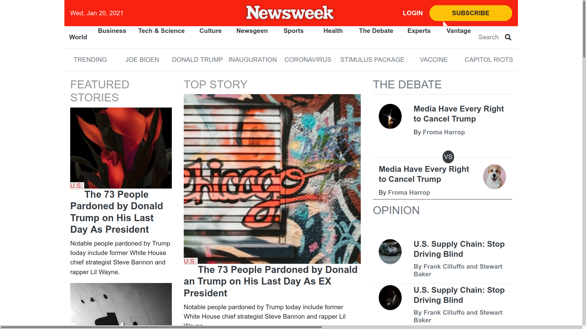

# Newsweek

> One paragraph statement about the project.

This is a replica of Newsweek website built with bootstrap and it's rich component.

## Built With

- HTML
- CSS
- Bootstrap

## Live Demo

[Live Demo Link](https://shaher-11.github.io/Newsweek/)

## Getting Started

**Clone the repo or download the zip folder**
**Open the html file with your browser**

## Authors

👤 **Author1**

- GitHub: [@githubhandle](https://github.com/Shaher-11/)
- Twitter: [@twitterhandle](https://twitter.com/ShaherShamroukh/)
- LinkedIn: [LinkedIn](https://www.linkedin.com/in/shaher-shamroukh/)

👤 **Author2**

- GitHub: [@githubhandle](https://github.com/Deepakdanger )
- Twitter: [@twitterhandle](https://twitter.com/twitterhandle)
- LinkedIn: [LinkedIn](https://linkedin.com/linkedinhandle)

## 🤝 Contributing

Contributions, issues, and feature requests are welcome!

Feel free to check the [issues page](issues/).

## Show your support

Give a ⭐️ if you like this project!

## Acknowledgments

- Newsweek
- Microverse

## 📝 License

This project is [MIT](lic.url) licensed.
